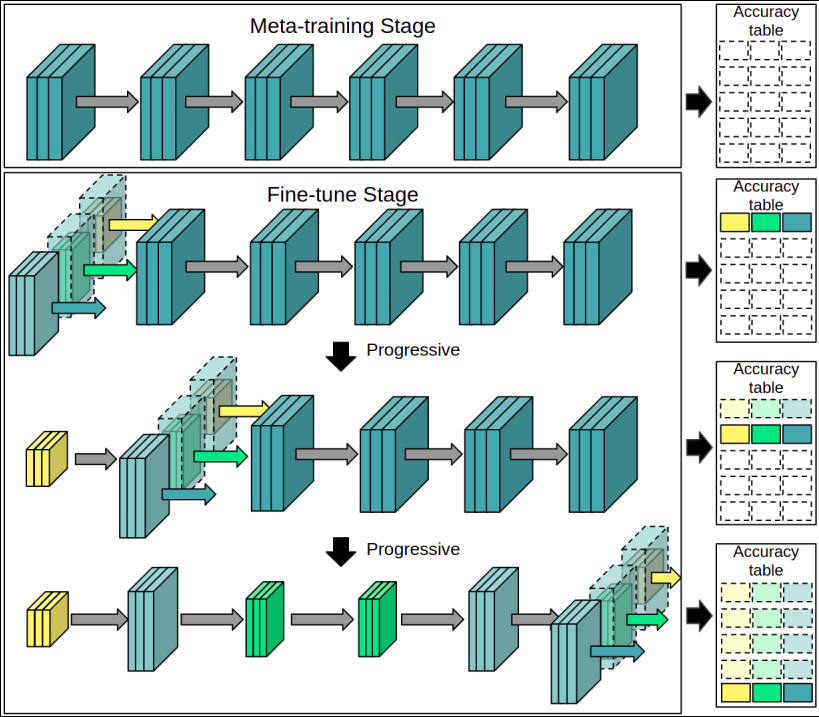
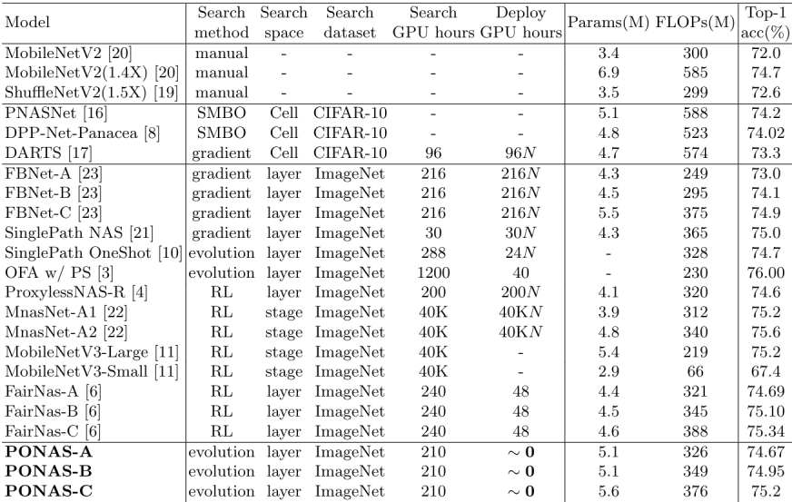
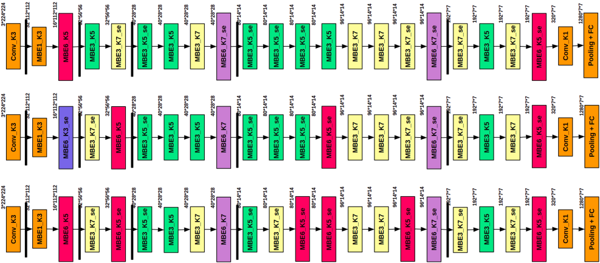

# PONAS: Progressive One-shot Neural Architecture Search for Very Efficient Deployment
## Introduction
We achieve very efficient deep learning model deployment that designs neural network architectures to fit different hardware constraints. Given a constraint, most neural architecture search (NAS) methods either sample a set of sub-networks according to a pre-trained accuracy predictor, or adopt the evolutionary algorithm to evolve specialized networks from the supernet. Both approaches are time consuming. Here our key idea for very efficient deployment is, when searching the architecture space, constructing a table that stores the validation accuracy of all candidate blocks at all layers. For a stricter hardware constraint, the architecture of a specialized network can be very efficiently determined based on this table by picking the best candidate blocks that yield the least accuracy loss. To accomplish this idea, we propose Progressive One-shot Neural Architecture Search (PONAS) that combines advantages of progressive NAS and one-shot methods. In PONAS, we propose a two-stage training scheme, including the meta training stage and the fine-tuning stage, to make the search process efficient and stable. During search, we evaluate candidate blocks in different layers and construct the accuracy table that is to be used in deployment. Comprehensive experiments verify that PONAS is extremely flexible, and is able to find architecture of a specialized network in around 10 seconds. In ImageNet classification, 75.2% top-1 accuracy can be obtained, which is comparable with the state of the arts.


## Experiments
### ImageNet Classification

### Network architectures


## Evaluate
To evaluate,
1. Set config in `config.yml`
2. Run
```
python3 test.py --cfg ./config.yml --model [PONASA|PONASB|PONASC] --pretrain [pretrained model path]
```

## Citation
```
@misc{2003.05112,
Author = {Sian-Yao Huang and Wei-Ta Chu},
Title = {PONAS: Progressive One-shot Neural Architecture Search for Very Efficient Deployment},
Year = {2020},
Eprint = {arXiv:2003.05112},
}
```
